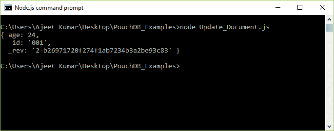
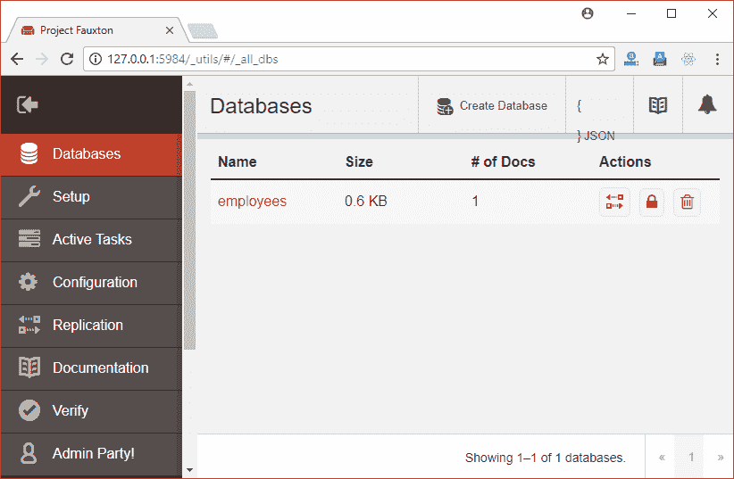
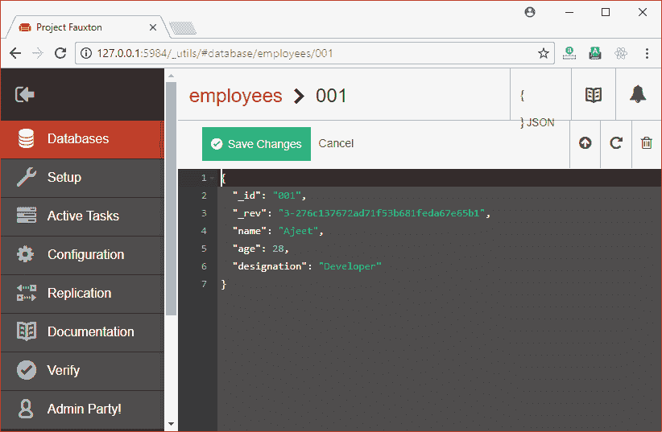
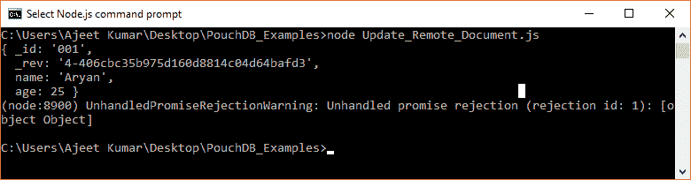

# 公共数据库更新文档

> 原文：<https://www.javatpoint.com/pouchdb-update-document>

可以使用(_rev)更新 PouchDB 中的文档。当我们在 PouchDB 中创建文档时，会生成一个 _rev。它被称为修订标记。_rev 的值是一个唯一的随机数，每次我们更改文档时 _rev 的值都会改变。

要更新文档，我们必须检索要更新的文档的 _rev 值。

现在，将需要更新的内容以及检索到的 _rev 值放在一个新文档中，最后使用 put()方法将这个文档插入到 PouchDB 中。

* * *

## 更新文档示例

首先从文档中检索数据，得到它的版本号。

使用读取文档方法。

```

{ _id: '001',
  _rev: '1-99a7a80ec2a74959885037a16d57924f' }
  name: 'Ajeet',
  age: 28,
  designation: 'Developer' }

```

现在使用 _rev 并将“年龄”的值更新为 24。请参见以下代码:

```

//Requiring the package
var PouchDB = require('PouchDB');
//Creating the database object
var db = new PouchDB('Second_Database');
//Preparing the document for update
doc = {
   age: 24,
_id: '001',
  _rev: '1-99a7a80ec2a74959885037a16d57924f' 
   }

//Inserting Document
db.put(doc);
//Reading the contents of a Document
db.get('001', function(err, doc) {
   if (err) {
      return console.log(err);
   } else {
      console.log(doc);
   }
});

```

将上述代码保存在一个名为“更新文档”的文件中，该文件位于一个名为“PouchDB_Examples”的文件夹中。打开命令提示符，并使用节点执行 JavaScript 文件:

```

node Update_Document.js

```

输出:

```
{ age: 24,
  _id: '001',
  _rev: '2-b26971720f274f1ab7234b3a2be93c83' }

```



* * *

## 更新远程数据库中的文档

您可以更新远程存储在 CouchDB 服务器上的数据库中的现有文档。为此，您必须传递包含要更新的文档的数据库的路径。

### 例子

我们在 CouchDB 服务器上有一个名为“雇员”的数据库。



通过点击“员工”，你会发现它有一个文档。



让我们更新 id 为“001”的文档的名称和年龄，该文档存在于数据库“employees”中，并存储在 CouchDB Server 上。

**更新:**

```

<!-- Name: Ajeet to Aryan
Age: 28 t0 25-->

```

```

//Requiring the package
var PouchDB = require('PouchDB');
//Creating the database object
var db = new PouchDB('http://localhost:5984/employees');
//Preparing the document for update
doc = {
  "_id": "001",
  "_rev": "3-276c137672ad71f53b681feda67e65b1",
  "name": "Aryan",
  "age": 25
   }
//Inserting Document
db.put(doc);
//Reading the contents of a Document
db.get('001', function(err, doc) {
   if (err) {
      return console.log(err);
   } else {
      console.log(doc);
   }
});   

```

将上述代码保存在名为“PouchDB_Examples”的文件夹中名为“Update_Remote_Document.js”的文件中。打开命令提示符，并使用节点执行 JavaScript 文件:

```

node Update_Remote_Document.js

```

输出:

```
{ _id: '001',
  _rev: '4-406cbc35b975d160d8814c04d64bafd3',
  name: 'Aryan',
  age: 25 }

```



您还可以看到文档已在 CouchDB 服务器上成功更改。

