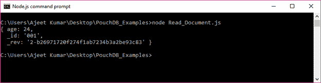
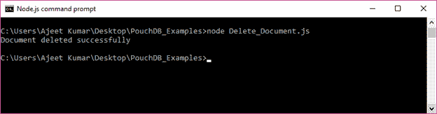
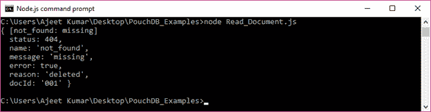
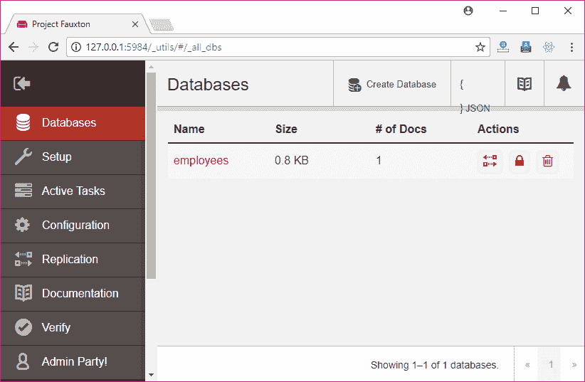
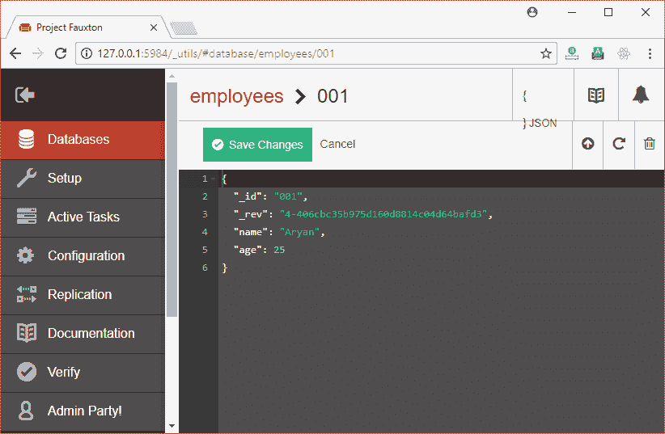
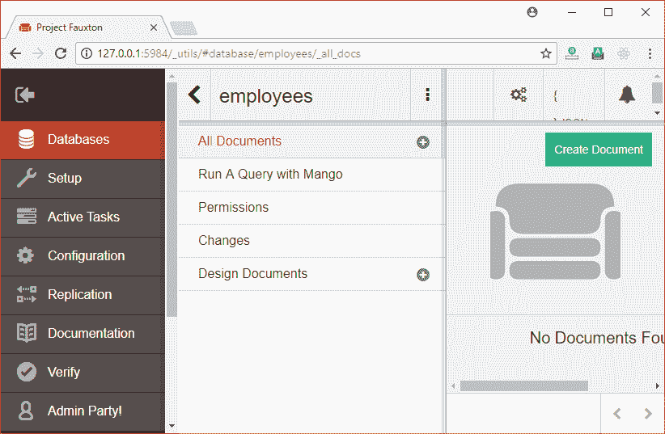
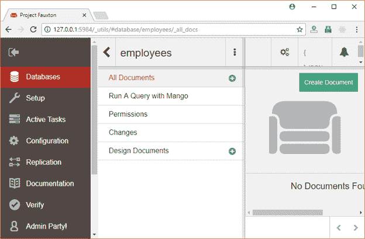

# 删除文档

> 原文：<https://www.javatpoint.com/pouchdb-delete-document>

db.remove()方法用于从 PouchDB 数据库中删除文档。您必须传递 id 和 _rev 值才能删除现有文档。这个方法接受一个可选的回调函数。您也可以传递完整的文档，而不是 id 和 _rev。

**语法:**

```js

db.remove( doc_Id, doc_Rev, [callback] )

```

* * *

## 删除文档示例

首先使用“读取文档”方法检索要删除的文档的值。

```js

{ age: 24,
  _id: '001',
  _rev: '2-b26971720f274f1ab7234b3a2be93c83' }

```

该文档存储在 PouchDB 中名为“Second_Database”的数据库中。



现在，对文档的 _rev 值和 id 使用 remove()方法。

```js

//Requiring the package
var PouchDB = require('PouchDB');
//Creating the database object
var db = new PouchDB('Second_Database');
//Deleting an existing document
db.remove('001', '2-b26971720f274f1ab7234b3a2be93c83', function(err) {
   if (err) {
      return console.log(err);
   } else {
      console.log("Document deleted successfully");
   }
});

```

将上述代码保存在名为“PouchDB_Examples”的文件夹中名为“Delete_Document.js”的文件中。打开命令提示符，并使用节点执行 JavaScript 文件:

```js

node Delete_Document.js

```

输出:



* * *

## 确认

您可以通过检索文档来验证您的文档是否被删除。如果被删除，它将显示消息:



您可以看到该文档已被删除。

* * *

## 从远程数据库中删除文档

您可以删除远程存储在 CouchDB 服务器上的数据库中的现有文档。为此，您必须传递包含要删除的文档的数据库的路径。

### 例子

我们在 CouchDB 服务器上有一个名为“雇员”的数据库。



员工数据库有一个 id 为“001”的文档。



让我们删除上面的文档。

```js

//Requiring the package
var PouchDB = require('PouchDB');
//Creating the database object
var db = new PouchDB('http://localhost:5984/employees');
//Deleting an existing document
db.remove('001', '4-406cbc35b975d160d8814c04d64bafd3', function(err) {
   if (err) {
      return console.log(err);
   } else {
      console.log("Document deleted successfully");
   }
});

```

将上述代码保存在名为“PouchDB_Examples”的文件夹中名为“Delete_Remote_Document.js”的文件中。打开命令提示符，并使用节点执行 JavaScript 文件:

```js

node Delete_Remote_Document.js

```

输出:



* * *

## 确认

检查 CouchDB 服务器。“员工”数据库中没有文档。

