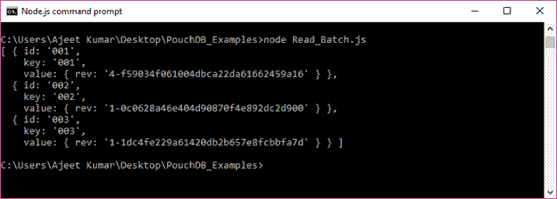
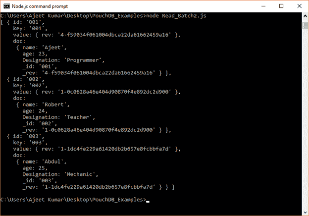
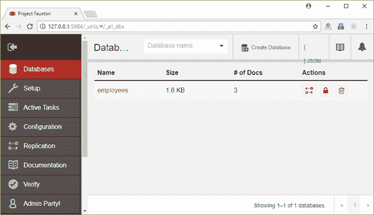
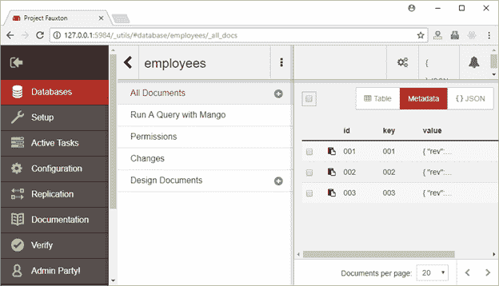
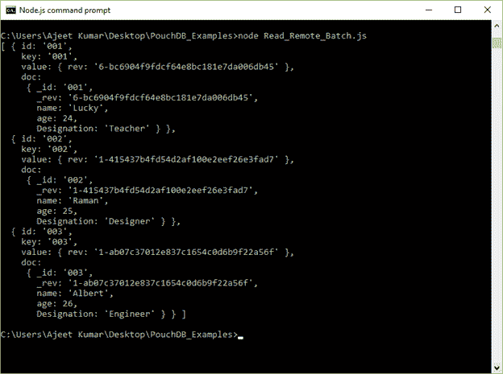

# 批量读取

> 原文：<https://www.javatpoint.com/pouchdb-read-batch>

在 PouchDB 中，allDocs()方法用于从数据库中读取或检索多个或批量文档。

这个方法接受一个可选的回调函数。

**语法:**

```

db.allDocs() 

```

* * *

## 读取批处理示例

让我们举一个例子，通过使用 db.allDocs()方法从存储在 PouchDB 服务器中的名为“Second_Database”的数据库中检索所有文档。此方法以对象的形式检索批处理。

```

//Requiring the package
var PouchDB = require('PouchDB');
//Creating the database object
var db = new PouchDB('Second_Database');
//Retrieving all the documents in PouchDB
db.allDocs(function(err, docs) {
   if (err) {	
      return console.log(err);
   } else {
      console.log (docs.rows);
   }
});

```

将上述代码保存在一个名为“PouchDB_Examples”的文件夹中的名为“Read_Batch.js”的文件中。打开命令提示符，并使用节点执行 JavaScript 文件:

```

node Read_Batch.js

```

输出:

```
[ { id: '001',
    key: '001',
    value: { rev: '4-f59034f061004dbca22da61662459a16' } },
  { id: '002',
    key: '002',
    value: { rev: '1-0c0628a46e404d90870f4e892dc2d900' } },
  { id: '003',
    key: '003',
    value: { rev: '1-1dc4fe229a61420db2b657e8fcbbfa7d' } } ]

```



通常，通过使用 allDocs()方法，您只能看到每个文档的 _id、key 和 _rev 字段。如果想在结果中看到整个文档，必须将可选参数 include_docs 设置为 true。

```

//Requiring the package
var PouchDB = require('PouchDB');
//Creating the database object
var db = new PouchDB('Second_Database');
//Retrieving all the documents in PouchDB
db.allDocs({include_docs: true}, function(err, docs) {
   if (err) {
      return console.log(err);
   } else {
      console.log (docs.rows);
   }
});

```

将上述代码保存在一个名为“PouchDB_Examples”的文件夹中的名为“Read_Batch2.js”的文件中。打开命令提示符，并使用节点执行 JavaScript 文件:

```

node Read_Batch2.js

```

输出:

```
[ { id: '001',
    key: '001',
    value: { rev: '4-f59034f061004dbca22da61662459a16' },
    doc:
     { name: 'Ajeet',
       age: 23,
       Designation: 'Programmer',
       _id: '001',
       _rev: '4-f59034f061004dbca22da61662459a16' } },
  { id: '002',
    key: '002',
    value: { rev: '1-0c0628a46e404d90870f4e892dc2d900' },
    doc:
     { name: 'Robert',
       age: 24,
       Designation: 'Teacher',
       _id: '002',
       _rev: '1-0c0628a46e404d90870f4e892dc2d900' } },
  { id: '003',
    key: '003',
    value: { rev: '1-1dc4fe229a61420db2b657e8fcbbfa7d' },
    doc:
     { name: 'Abdul',
       age: 25,
       Designation: 'Mechanic',
       _id: '003',
       _rev: '1-1dc4fe229a61420db2b657e8fcbbfa7d' } } ]

```



* * *

## 从远程数据库读取批处理

您可以从远程存储在 CouchDB 服务器上的数据库中读取一个批处理。为此，您必须传递要读取批处理的数据库路径。

### 例子

我们在 CouchDB 服务器上有一个名为“雇员”的数据库。




让我们阅读存储在 CouchDB 服务器上的“员工”数据库中的所有文档。

```

//Requiring the package
var PouchDB = require('PouchDB');
//Creating the database object
var db = new PouchDB('http://localhost:5984/employees');
//Retrieving all the documents in PouchDB
db.allDocs({include_docs: true}, function(err, docs) {
   if (err) {
      return console.log(err);
   } else {
      console.log(docs.rows);
   }
});

```

将上述代码保存在一个名为“PouchDB_Examples”的文件夹中，该文件名为“Read_Remote_Batch.js”。打开命令提示符，并使用节点执行 JavaScript 文件:

```

node Read_Remote_Batch.js

```

输出:

```
[ { id: '001',
    key: '001',
    value: { rev: '6-bc6904f9fdcf64e8bc181e7da006db45' },
    doc:
     { _id: '001',
       _rev: '6-bc6904f9fdcf64e8bc181e7da006db45',
       name: 'Lucky',
       age: 24,
       Designation: 'Teacher' } },
  { id: '002',
    key: '002',
    value: { rev: '1-415437b4fd54d2af100e2eef26e3fad7' },
    doc:
     { _id: '002',
       _rev: '1-415437b4fd54d2af100e2eef26e3fad7',
       name: 'Raman',
       age: 25,
       Designation: 'Designer' } },
  { id: '003',
    key: '003',
    value: { rev: '1-ab07c37012e837c1654c0d6b9f22a56f' },
    doc:
     { _id: '003',
       _rev: '1-ab07c37012e837c1654c0d6b9f22a56f',
       name: 'Albert',
       age: 26,
       Designation: 'Engineer' } } ]

```

