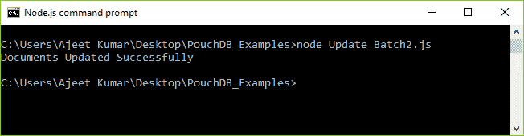
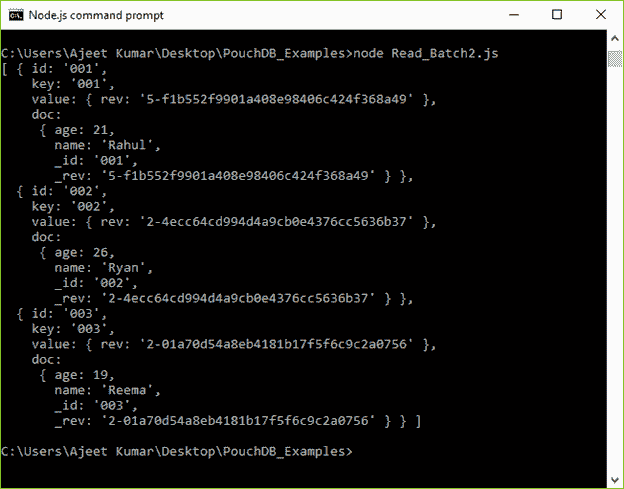
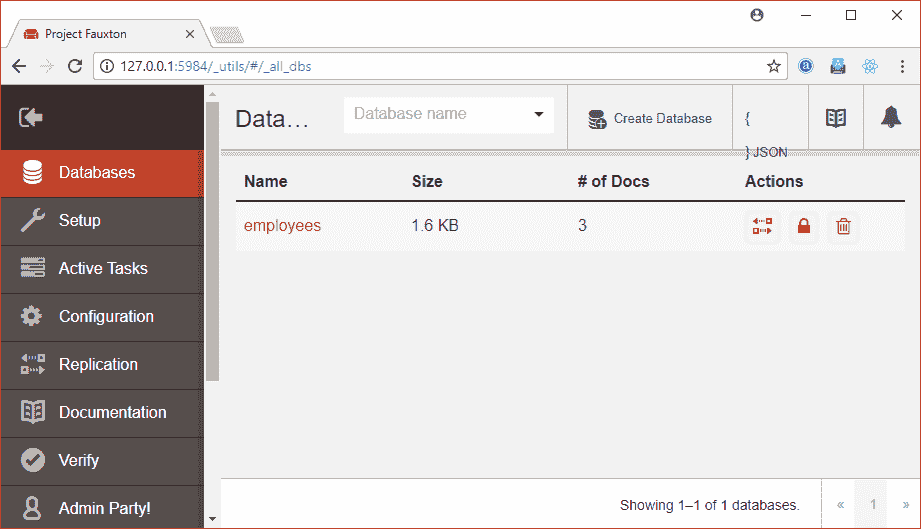
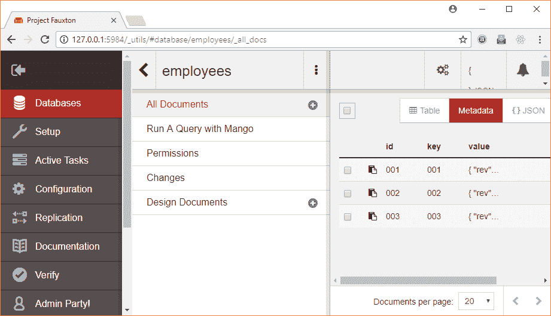
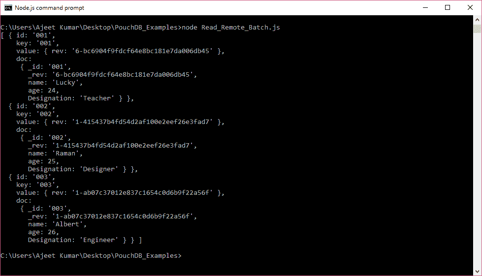
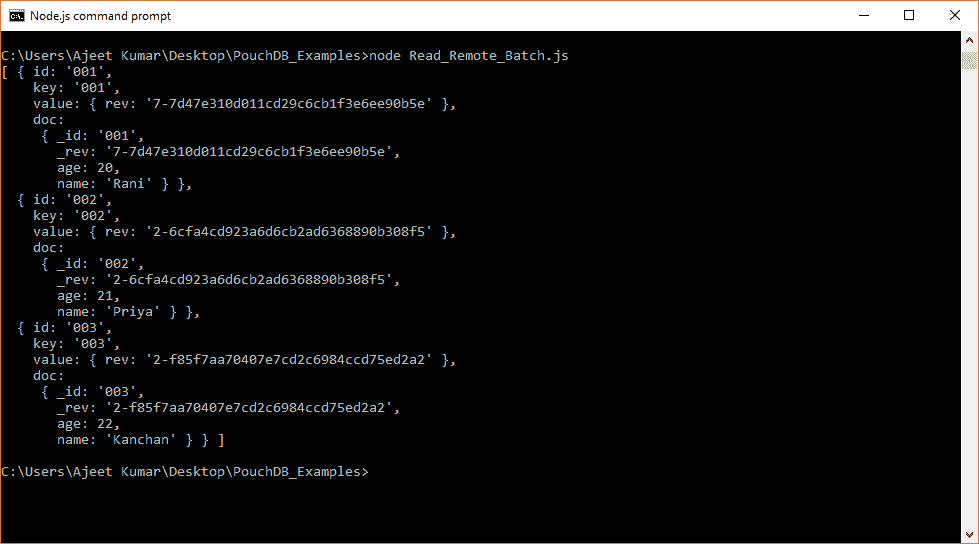

# 分组数据库更新批次

> 原文：<https://www.javatpoint.com/pouchdb-update-batch>

bulkDocs()方法用于更新 PouchDB 中的文档数组。要更新一个批处理，您必须创建一个文档数组，其中每个文档包含 _id，_rev 和您想要更新的值。

我们有一个名为“Second_Database”的数据库存储在 PouchDB 中，包含 3 个文档:

```js
{ id: '001',
    key: '001',
    value: { rev: '4-f59034f061004dbca22da61662459a16' },
    doc:
     { name: 'Ajeet',
       age: 23,
       Designation: 'Programmer',
       _id: '001',
       _rev: '4-f59034f061004dbca22da61662459a16' } },
  { id: '002',
    key: '002',
    value: { rev: '1-0c0628a46e404d90870f4e892dc2d900' },
    doc:
     { name: 'Robert',
       age: 24,
       Designation: 'Teacher',
       _id: '002',
       _rev: '1-0c0628a46e404d90870f4e892dc2d900' } },
  { id: '003',
    key: '003',
    value: { rev: '1-1dc4fe229a61420db2b657e8fcbbfa7d' },
    doc:
     { name: 'Abdul',
       age: 25,
       Designation: 'Mechanic',
       _id: '003',
       _rev: '1-1dc4fe229a61420db2b657e8fcbbfa7d' } } ]

```

让我们使用它们各自的 _id 和 _rev 值来更新文档:

更改所有三个文档的名称和期限:

```js
//Requiring the package
var PouchDB = require('PouchDB');
//Creating the database object
var db = new PouchDB('Second_Database');
//Preparing the document
docs = [{_id : '001', _rev:'4-f59034f061004dbca22da61662459a16', age : 21, name:  'Rahul', },
      {_id : '002', _rev: '1-0c0628a46e404d90870f4e892dc2d900', age : 26, name:  'Ryan', },
      {_id : '003', _rev: '1-1dc4fe229a61420db2b657e8fcbbfa7d', age : 19, name: 'Reema', }]
//Updating the documents in bulk
db.bulkDocs(docs, function(err, response) {
   if (err) {
      return console.log(err);
   } else {
      console.log("Documents Updated Successfully");
   }
});

```

将上述代码保存在名为“PouchDB_Examples”的文件夹中名为“Update_Batch2.js”的文件中。打开命令提示符，并使用节点执行 JavaScript 文件:

```js
node Update_Batch2.js

```

输出:



* * *

## 确认

您可以使用节点(读取批处理)命令来验证批处理是否已更新:



```js
[ { id: '001',
    key: '001',
    value: { rev: '5-f1b552f9901a408e98406c424f368a49' },
    doc:
     { age: 21,
       name: 'Rahul',
       _id: '001',
       _rev: '5-f1b552f9901a408e98406c424f368a49' } },
  { id: '002',
    key: '002',
    value: { rev: '2-4ecc64cd994d4a9cb0e4376cc5636b37' },
    doc:
     { age: 26,
       name: 'Ryan',
       _id: '002',
       _rev: '2-4ecc64cd994d4a9cb0e4376cc5636b37' } },
  { id: '003',
    key: '003',
    value: { rev: '2-01a70d54a8eb4181b17f5f6c9c2a0756' },
    doc:
     { age: 19,
       name: 'Reema',
       _id: '003',
       _rev: '2-01a70d54a8eb4181b17f5f6c9c2a0756' } } ]

```

* * *

## 在远程数据库中更新批处理

我们还可以更新远程存储在服务器(CouchDB)上的数据库中的一系列文档。您只需将路径传递到 CouchDB 中的数据库，该数据库包含要更新的文档。

### 例子

我们在 CouchDB 服务器中有一个名为“雇员”的数据库。



“员工”数据库中有三个文档



可以使用 node (Read_Remote_Batch.js)命令获取这些文档。

```js
[ { id: '001',
    key: '001',
    value: { rev: '6-bc6904f9fdcf64e8bc181e7da006db45' },
    doc:
     { _id: '001',
       _rev: '6-bc6904f9fdcf64e8bc181e7da006db45',
       name: 'Lucky',
       age: 24,
       Designation: 'Teacher' } },
  { id: '002',
    key: '002',
    value: { rev: '1-415437b4fd54d2af100e2eef26e3fad7' },
    doc:
     { _id: '002',
       _rev: '1-415437b4fd54d2af100e2eef26e3fad7',
       name: 'Raman',
       age: 25,
       Designation: 'Designer' } },
  { id: '003',
    key: '003',
    value: { rev: '1-ab07c37012e837c1654c0d6b9f22a56f' },
    doc:
     { _id: '003',
       _rev: '1-ab07c37012e837c1654c0d6b9f22a56f',
       name: 'Albert',
       age: 26,
       Designation: 'Engineer' } } ]

```



现在更新存储在 CouchDB 服务器上的“员工”数据库的所有文档名称和年龄。

```js
//Requiring the package 
var PouchDB = require('PouchDB');
//Creating the database object 
var db = new PouchDB('http://localhost:5984/employees'); 
//Preparing the document 
docs = [{_id : '001', _rev:'6-bc6904f9fdcf64e8bc181e7da006db45', age : 20, name: 'Rani'  }, 
      {_id : '002', _rev: '1-415437b4fd54d2af100e2eef26e3fad7', age : 21, 
name: 'Priya' }, 
      {_id : '003', _rev: '1-ab07c37012e837c1654c0d6b9f22a56f', age : 22, 
name: 'Kanchan'}]
//Inserting Document 
db.bulkDocs(docs, function(err, response) { 
   if (err) { 
      return console.log(err); 
   } else { 
      console.log(+"Documents Updated Successfully"); 
   } 
});

```

将上述代码保存在一个名为“PouchDB_Examples”的文件夹中，该文件名为“Update_Remote_Batch.js”。打开命令提示符，并使用节点执行 JavaScript 文件:

```js
node Update_Remote_Batch.js

```

它将更新“员工”数据库中的文档。

* * *

## 确认

您可以使用节点(读取远程批处理)命令验证批处理是否已更新:



```js
[ { id: '001',
    key: '001',
    value: { rev: '7-7d47e310d011cd29c6cb1f3e6ee90b5e' },
    doc:
     { _id: '001',
       _rev: '7-7d47e310d011cd29c6cb1f3e6ee90b5e',
       age: 20,
       name: 'Rani' } },
  { id: '002',
    key: '002',
    value: { rev: '2-6cfa4cd923a6d6cb2ad6368890b308f5' },
    doc:
     { _id: '002',
       _rev: '2-6cfa4cd923a6d6cb2ad6368890b308f5',
       age: 21,
       name: 'Priya' } },
  { id: '003',
    key: '003',
    value: { rev: '2-f85f7aa70407e7cd2c6984ccd75ed2a2' },
    doc:
     { _id: '003',
       _rev: '2-f85f7aa70407e7cd2c6984ccd75ed2a2',
       age: 22,
       name: 'Kanchan' } } ]

```