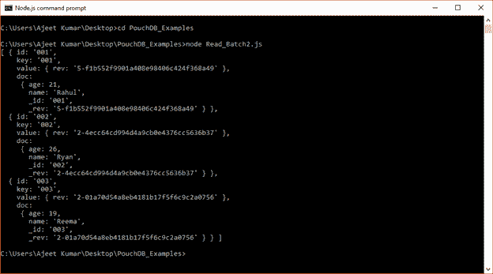
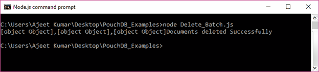
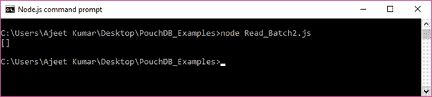
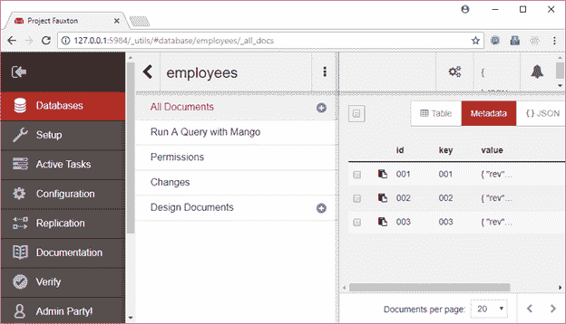
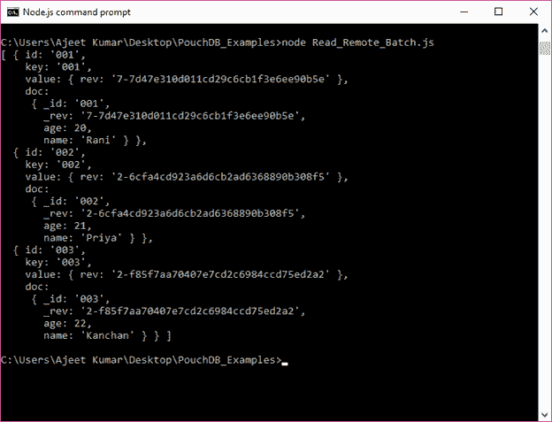
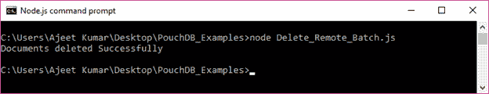
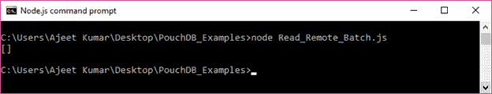

# 删除批处理

> 原文：<https://www.javatpoint.com/pouchdb-delete-batch>

bulkDocs()方法用于删除 PouchDB 中的文档数组。您只需要知道要从数据库中删除的文档的 _id 和 _rev 值。您必须添加另一个键值对 _deleted: true。

我们有一个名为“Second_Database”的数据库存储在 PouchDB 中，包含 3 个文档:

```js

[ { id: '001',
    key: '001',
    value: { rev: '5-f1b552f9901a408e98406c424f368a49' },
    doc:
     { age: 21,
       name: 'Rahul',
       _id: '001',
       _rev: '5-f1b552f9901a408e98406c424f368a49' } },
  { id: '002',
    key: '002',
    value: { rev: '2-4ecc64cd994d4a9cb0e4376cc5636b37' },
    doc:
     { age: 26,
       name: 'Ryan',
       _id: '002',
       _rev: '2-4ecc64cd994d4a9cb0e4376cc5636b37' } },
  { id: '003',
    key: '003',
    value: { rev: '2-01a70d54a8eb4181b17f5f6c9c2a0756' },
    doc:
     { age: 19,
       name: 'Reema',
       _id: '003',
       _rev: '2-01a70d54a8eb4181b17f5f6c9c2a0756' } } ]

```



让我们使用它们各自的 _id 和 _rev 值来删除文档:

```js

//Requiring the package
var PouchDB = require('PouchDB');
//Creating the database object
var db = new PouchDB('Second_Database');
//Preparing the document
docs = [{_id : '001', _rev: '5-f1b552f9901a408e98406c424f368a49', _deleted : true },
      {_id : '002', _rev: '2-4ecc64cd994d4a9cb0e4376cc5636b37', _deleted : true }, 
      {_id : '003', _rev: '2-01a70d54a8eb4181b17f5f6c9c2a0756', _deleted : true }]
//Deleting Documents
db.bulkDocs(docs, function(err, response) {
   if (err) {
      return console.log(err);
   } else {
      console.log(response+"Documents deleted Successfully");
   }
});

```

将上述代码保存在名为“PouchDB_Examples”的文件夹中名为“Delete_Batch.js”的文件中。打开命令提示符，并使用节点执行 JavaScript 文件:

```js

node Delete_Batch.js

```

输出:



该批次现已删除。也可以验证一下。

* * *

## 确认



您可以看到数据库中没有文档。

* * *

## 从远程数据库中删除批处理

我们还可以删除远程存储在服务器(CouchDB)上的数据库中的一系列文档。您只需将路径传递到 CouchDB 中的数据库，该数据库包含要删除的文档。

### 例子

我们在 CouchDB 服务器中有一个名为“雇员”的数据库。


“员工”数据库中有三个文档



可以使用 node (Read_Remote_Batch.js)命令获取这些文档。

```js

{ id: '001',
    key: '001',
    value: { rev: '7-7d47e310d011cd29c6cb1f3e6ee90b5e' },
    doc:
     { _id: '001',
       _rev: '7-7d47e310d011cd29c6cb1f3e6ee90b5e',
       age: 20,
       name: 'Rani' } },
  { id: '002',
    key: '002',
    value: { rev: '2-6cfa4cd923a6d6cb2ad6368890b308f5' },
    doc:
     { _id: '002',
       _rev: '2-6cfa4cd923a6d6cb2ad6368890b308f5',
       age: 21,
       name: 'Priya' } },
  { id: '003',
    key: '003',
    value: { rev: '2-f85f7aa70407e7cd2c6984ccd75ed2a2' },
    doc:
     { _id: '003',
       _rev: '2-f85f7aa70407e7cd2c6984ccd75ed2a2',
       age: 22,
       name: 'Kanchan' } } ]

```



现在删除数据库“员工”的所有文档。

```js

//Requiring the package
var PouchDB = require('PouchDB');
//Creating the database object
var db = new PouchDB('http://localhost:5984/employees');
//Preparing the document
docs = [{_id : '001', _rev: '7-7d47e310d011cd29c6cb1f3e6ee90b5e', _deleted : true },
      {_id : '002', _rev: '2-6cfa4cd923a6d6cb2ad6368890b308f5', _deleted : true },
      {_id : '003', _rev: '2-f85f7aa70407e7cd2c6984ccd75ed2a2', _deleted : true }]
//Deleting Documents
db.bulkDocs(docs, function(err, response) {
   if (err) {
      return console.log(err);	
   } else {
      console.log("Documents deleted Successfully");
   }
});

```

将上述代码保存在名为“PouchDB_Examples”的文件夹中的一个名为“Delete_Remote_Batch.js”的文件中。打开命令提示符，并使用节点执行 JavaScript 文件:

```js

node Delete_Remote_Batch.js

```

输出:



* * *

## 确认

您可以看到“员工”数据库中没有文档。

