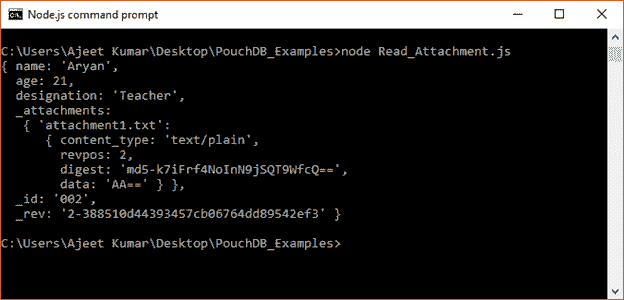
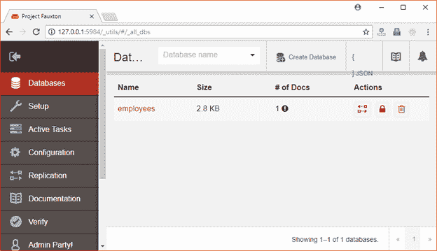
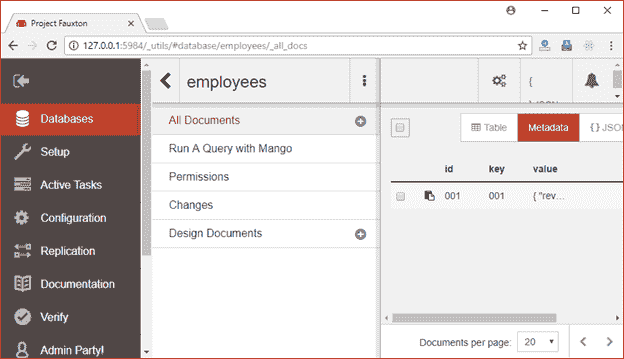
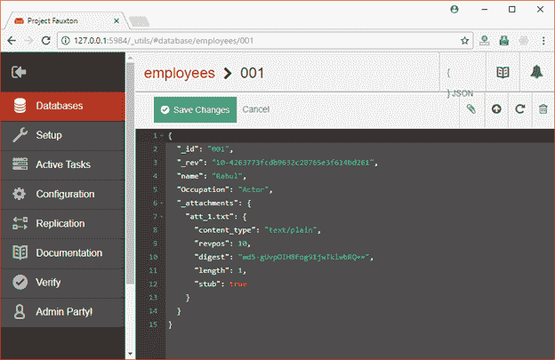
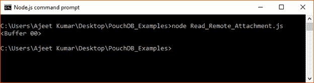

# 检索附件

> 原文：<https://www.javatpoint.com/pouchdb-retrieve-attachment>

getAttachment()方法用于从 PouchDB 中检索附件。此方法总是返回 blob 或缓冲区对象。

您必须传递文档 id 和附件 id 才能使用此方法。这个方法也接受一个可选的回调函数。

**语法:**

```js

db.getAttachment( docId, attachmentId, [callback] ); 

```

* * *

## 检索附件示例

让我们使用 getAttachment()方法从名为“Last_Database”的数据库中检索文档“002”中的附件 attachment_1.txt。

```js

//Requiring the package 
var PouchDB = require('PouchDB');

//Creating the database object 

var db = new PouchDB('Last_Database');

//Reading the Document 
db.get('002',{attachments: true}, function(err, doc) { 
   if (err) { 
      return console.log(err); 
   } else { 
      console.log(doc); 
   } 
});

```

将上述代码保存在名为“PouchDB_Examples”的文件夹中的一个名为“Read_Attachment.js”的文件中。打开命令提示符，并使用节点执行 JavaScript 文件:

```js

node Read_Attachment.js

```



* * *

## 从远程文档中检索附件

您也可以从远程存储的服务器(CouchDB)中检索附件。您只需将路径传递到 CouchDB 中的数据库，该数据库包含您想要读取的文档。

### 例子

我们在 CouchDB 服务器上存储了一个名为“雇员”的数据库。



点击“员工”数据库。您将看到数据库中的文档。



您可以看到 id 为“001”的文档。点击 id，你会找到附件。



您可以通过使用 Node.js 命令提示符来查看它:

```js

//Requiring the package 
var PouchDB = require('PouchDB');

//Creating the database object 
var db = new PouchDB('http://localhost:5984/employees');

//Retrieving an attachment from a document 
db.getAttachment('001', 'att_1.txt', function(err, blob_buffer) { 
   if (err) { 
      return console.log(err); 
   } else { 
      console.log(blob_buffer); 
   } 
});

```

将上述代码保存在一个名为“PouchDB_Examples”的文件夹中，该文件名为“Read_Remote_Attachment.js”。打开命令提示符，并使用节点执行 JavaScript 文件:

```js

node Read_Remote_Attachment.js

```

输出:

