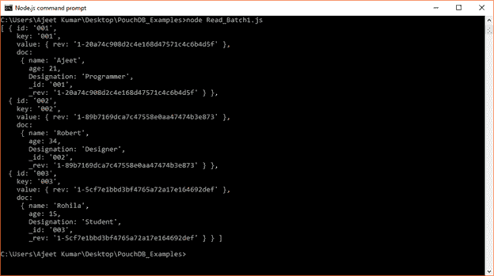
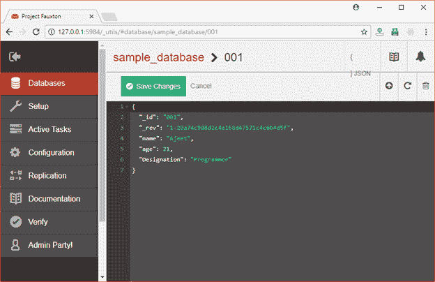
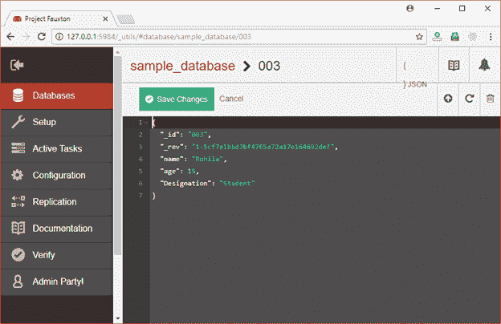
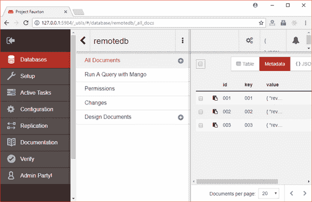
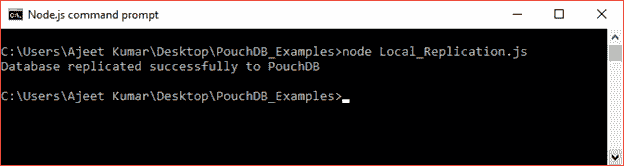
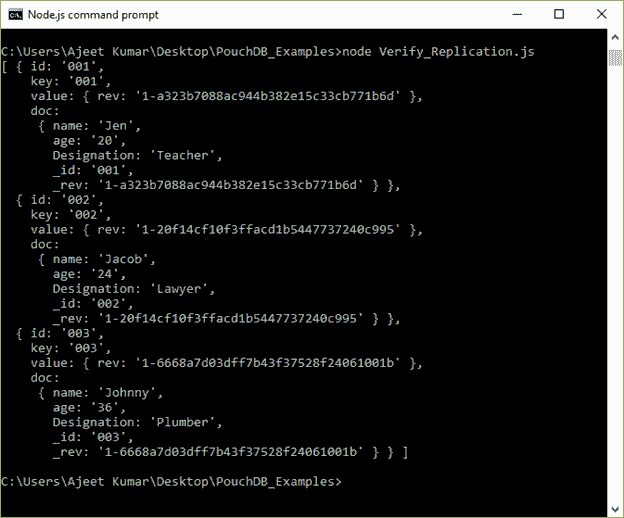

# 数据库复制

> 原文：<https://www.javatpoint.com/pouchdb-replication>

复制是 PouchDB 的一个非常重要的特性。它便于您制作数据库的副本。您可以复制本地存储的 PouchDB 实例，也可以复制远程存储的 CouchDB 实例。

使用此方法时，可以直接以字符串格式传递源数据库和目标数据库的位置，也可以传递表示它们的对象。

**语法**

```js

PouchDB.replicate(source, target, [options])

```

源和目标都可以是 PouchDB 实例或 CouchDB 实例。

* * *

## 将 PouchDB(本地)复制到 CouchDB

让我们以 PouchDB 中名为“sample_database”的数据库为例，它有 3 个文档 doc1、doc2 和 doc3，内容如下。



```js

{ id: '001',
    key: '001',
    value: { rev: '1-20a74c908d2c4e168d47571c4c6b4d5f' },
    doc:
     { name: 'Ajeet',
       age: 21,
       Designation: 'Programmer',
       _id: '001',
       _rev: '1-20a74c908d2c4e168d47571c4c6b4d5f' } },
  { id: '002',
    key: '002',
    value: { rev: '1-89b7169dca7c47558e0aa47474b3e873' },
    doc:
     { name: 'Robert',
       age: 34,
       Designation: 'Designer',
       _id: '002',
       _rev: '1-89b7169dca7c47558e0aa47474b3e873' } },
  { id: '003',
    key: '003',
    value: { rev: '1-5cf7e1bbd3bf4765a72a17e164692def' },
    doc:
     { name: 'Rohila',
       age: 15,
       Designation: 'Student',
       _id: '003',
       _rev: '1-5cf7e1bbd3bf4765a72a17e164692def' } } ]

```

现在在 CouchDB 中创建此数据库的复制:

```js

//Requiring the package 
var PouchDB = require('PouchDB');
var localDB = 'sample_database';
//Creating remote database object 
var remoteDB = 'http://localhost:5984/sample_database';
//Replicating a local database to Remote 
PouchDB.replicate(localDB, remoteDB); 
console.log ("Database replicated successfully");

```

将上述代码保存在名为“PouchDB_Examples”的文件夹中名为“Remote_Replication.js”的文件中。打开命令提示符，并使用节点执行 JavaScript 文件:

```js

node Remote_Replication.js

```

输出


* * *

## 确认

您可以打开 CouchDB 链接，看到创建了一个数据库“sample_database”。

图像:复制 3

您还可以在这里看到所有三个文档:






* * *

## 将 CouchDB 复制到 PouchDB

让我们在 CouchDB 服务器上创建一个名为“remotedb”的数据库，它包含三个文档 doc1、doc2 和 doc3，内容如下:

```js

doc1 = {_id: '001', name: 'Jen', age: 20, Designation: 'Teacher'}
doc2 = {_id: '002', name: 'Jacob', age: 24, Designation: 'Lawyer'}
doc3 = {_id: '003', name: 'Johnny', age: 36, Designation: 'Plumber'}

```



让我们在本地服务器 PouchDB 中复制这个数据库。

```js

//Requiring the package
var PouchDB = require('PouchDB');
var localdb = 'remotedb';
var remotedb2 = 'http://localhost:5984/remotedb';
//Replicating a local database to Remote
PouchDB.replicate(remotedb2, localdb);
console.log("Database replicated successfully to PouchDB");

```

将上述代码保存在名为“本地复制. js”的文件中，该文件位于名为“PouchDB_Examples”的文件夹中。打开命令提示符，并使用节点执行 JavaScript 文件:

```js

node Local_Replication.js

```

输出:



您可以使用以下代码来验证数据库是否在您的 bag 实例中复制。

```js

//Requiring the package
var PouchDB = require('PouchDB');
//Creating the database object
var db = new PouchDB('remotedb');
//Retrieving all the documents in PouchDB
db.allDocs({include_docs: true, attachments: true}, function(err, docs) {
   if (err) {
      return console.log(err);
   } else {
      console.log(docs.rows);
   }
});

```

将上述代码保存在一个名为“验证复制. js”的文件中，该文件位于一个名为“PouchDB_Examples”的文件夹中。打开命令提示符，并使用节点执行 JavaScript 文件:

```js

node Verify_Replication.js

```

输出



```js

{ id: '001',
    key: '001',
    value: { rev: '1-a323b7088ac944b382e15c33cb771b6d' },
    doc:
     { name: 'Jen',
       age: '20',
       Designation: 'Teacher',
       _id: '001',
       _rev: '1-a323b7088ac944b382e15c33cb771b6d' } },
  { id: '002',
    key: '002',
    value: { rev: '1-20f14cf10f3ffacd1b5447737240c995' },
    doc:
     { name: 'Jacob',
       age: '24',
       Designation: 'Lawyer',
       _id: '002',
       _rev: '1-20f14cf10f3ffacd1b5447737240c995' } },
  { id: '003',
    key: '003',
    value: { rev: '1-6668a7d03dff7b43f37528f24061001b' },
    doc:
     { name: 'Johnny',
       age: '36',
       Designation: 'Plumber',
       _id: '003',
       _rev: '1-6668a7d03dff7b43f37528f24061001b' } } ]

```