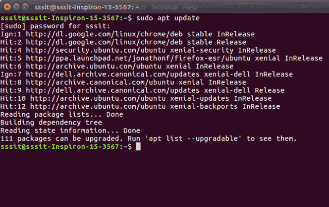
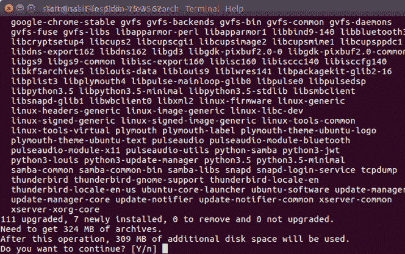
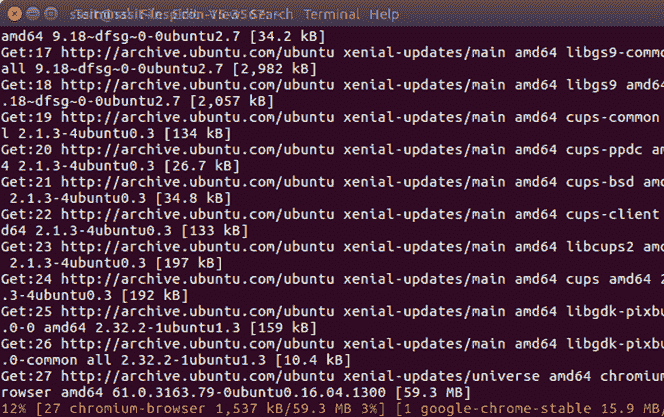
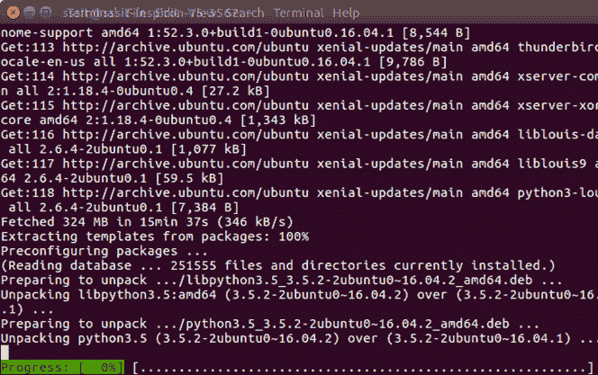
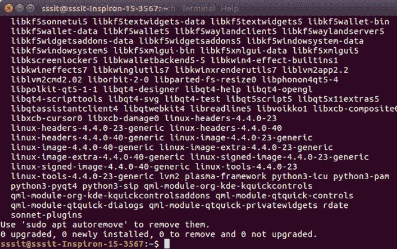
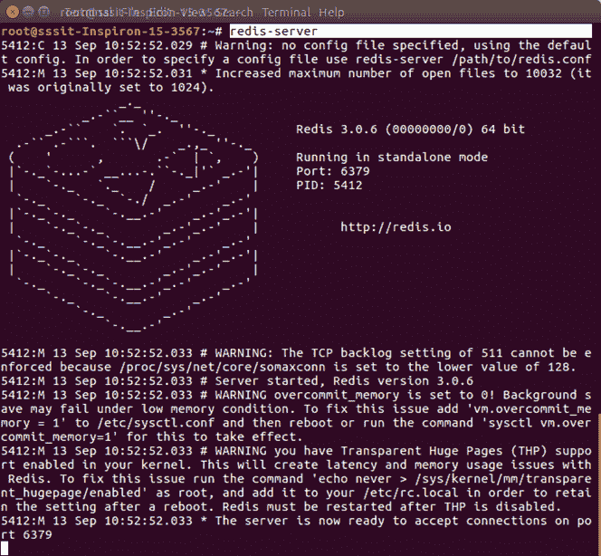
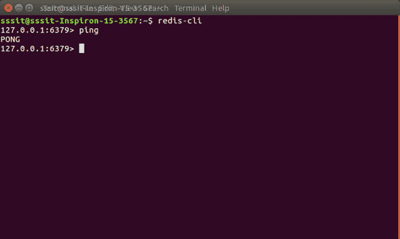

# 在 Ubuntu 上安装 Redis

> 哎哎哎:# t0]https://www . javatppoint . com/redis-installation-on-Ubuntu

按照下面给出的步骤在 Ubuntu 上安装 Redis:

首先使用 sudo 设置一个非根用户，然后安装构建和测试依赖项:

```
sudo apt update
sudo apt full-upgrade
sudo apt install build-essential tcl

```

 

要继续，请按“是”



## 安装重定向服务器

使用以下命令安装 Redis 服务器:

```
sudo apt-get install redis-server

```

 

现在安装了 Redis 服务器。您可以启动 Redis 服务器:

* * *

## 启动重定向服务器

您需要以下命令来启动 redis 服务器:

```
redis-server

```



## 开始重定向客户端

Redis 服务器启动后，您可以启动 redis 客户端来进行它们之间的通信。

```
redis-cli

```


* * *

## 验证 Redis 是否正常工作

执行以下命令:

```
redis-cli

```

这将打开一个 redis 提示。

**第 127.0.0.1 条:6379 >**

在上面的提示中，127.0.0.1 是机器的 IP 地址，6379 是运行 Redis 服务器的端口。

现在键入以下 PING 命令。

它指定 Redis 已成功安装在您的系统上。

