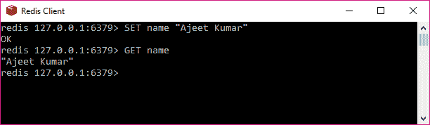
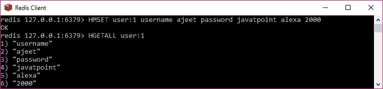
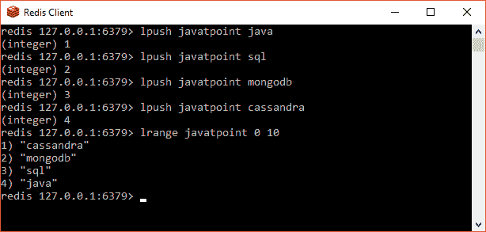
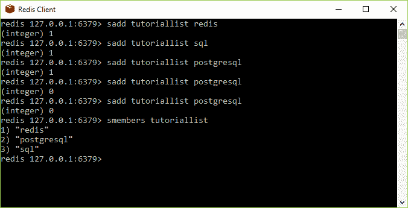
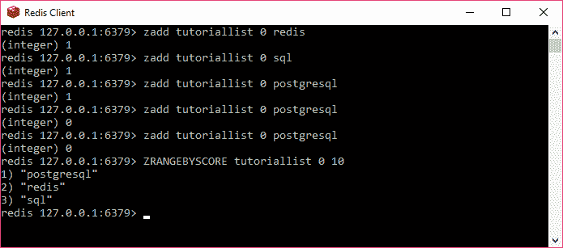

# Redis 数据类型

> 哎哎哎:# t0]https://www . javatppoint . com/redis-data-types

Redis 数据库支持五种类型的数据类型。

*   用线串
*   混杂
*   列表
*   设置
*   排序集

* * *

## 用线串

字符串是一组字节。在 Redis 数据库中，字符串是二进制安全的。这意味着它们具有已知的长度，并且不是由任何特殊的终止字符决定的。因此，在一个字符串中可以存储高达 512 兆字节的任何内容。

### 例子

让我们使用 SET 命令在密钥中存储一个名为“Ajeet Kumar”的字符串，然后使用 GET 命令检索该字符串。

```
SET name "Ajeet Kumar"
OK
GET name 
"Ajeet Kumar"

```



在上例中，SET 和 GET 是 Redis 命令，name 是 Redis 中使用的键，“Ajeet Kumar”是 Redis 中存储的字符串值。

* * *

## 混杂

哈希是键值对的集合。在 Redis 中，哈希是字符串字段和字符串值之间的映射。所以，它们被用来表示物体。

### 例子

让我们存储一个包含用户基本信息的用户对象。

```
HMSET user:1 username ajeet password javatpoint alexa 2000
OK
HGETALL  user:1
"username"
"ajeet"
"password"
"javatpoint"
"alexa"
"2000"

```



这里，HMSET 和 HGETALL 是 Redis 的命令，而 user:1 是关键。

每个哈希最多可以存储 232 - 1 个字段值对(超过 40 亿个)。

* * *

## 列表

Redis 列表被定义为按插入顺序排序的字符串列表。您可以在 Redis 列表的头部或尾部添加元素。

### 例子

```
lpush javatpoint java
(integer) 1
lpush javatpoint java
(integer) 1
lpush javatpoint java
(integer) 1
lpush javatpoint java
(integer) 1
lrange javatpoint 0 10
"cassandra"
"mongodb"
"sql"
"java"

```



列表的最大长度是 232 - 1 个元素(每个列表超过 40 亿个元素)。

* * *

## 设置

集合是 Redis 数据库中无序的字符串集合。在 Redis 中，您可以在 O(1)时间复杂度中添加、移除和测试成员的存在。

### 例子

```
sadd tutoriallist redis
(integer) 1
redis 127.0.0.1:6379> sadd tutoriallist sql
(integer) 1
redis 127.0.0.1:6379> sadd tutoriallist postgresql
(integer) 1
redis 127.0.0.1:6379> sadd tutoriallist postgresql
(integer) 0
redis 127.0.0.1:6379> sadd tutoriallist postgresql
(integer) 0
redis 127.0.0.1:6379> smembers tutoriallist
1) "redis"
2) "postgresql"
3) "sql"

```



在上面的例子中，您可以看到 postgresql 被添加了三次，但是由于集合的唯一属性，它只被添加了一次。

集合中成员的最大数量是 232 - 1 个元素(每个列表超过 40 亿个元素)。

* * *

## 排序集

Redis 排序集类似于 Redis 集。它们也是一组不重复的字符串集合。但是排序集的每个成员都与一个分数相关联，该分数用于将排序集从最小分数排序到最大分数。虽然成员是唯一的，但分数可能会重复。

### 例子

```
redis 127.0.0.1:6379> zadd tutoriallist 0 redis
(integer) 1
redis 127.0.0.1:6379> zadd tutoriallist 0 sql
(integer) 1
redis 127.0.0.1:6379> zadd tutoriallist 0 postgresql
(integer) 1
redis 127.0.0.1:6379> zadd tutoriallist 0 postgresql
(integer) 0
redis 127.0.0.1:6379> zadd tutoriallist 0 postgresql
(integer) 0
redis 127.0.0.1:6379> ZRANGEBYSCORE tutoriallist 0 10
1) "postgresql"
2) "redis"
3) "sql"

```

