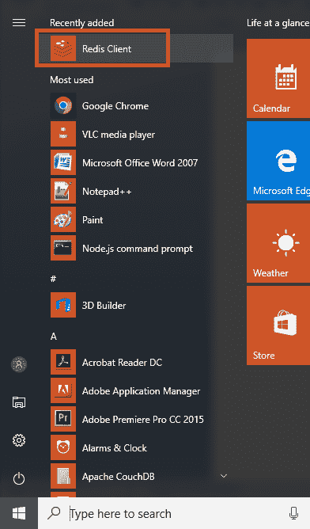
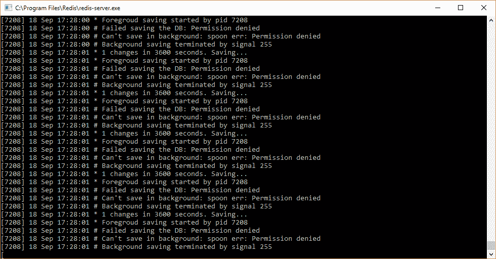
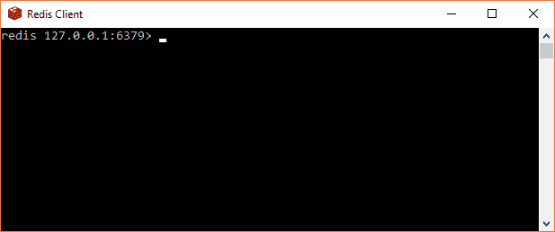
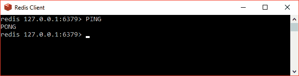
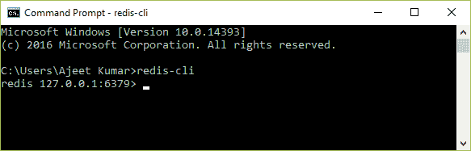
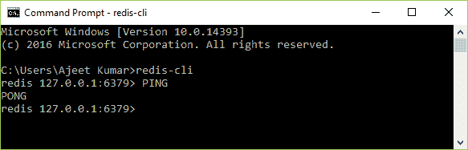

# 重复命令

> 哎哎哎:# t0]https://www . javatppoint . com/redis-commands

Redis 命令用于在 Redis 服务器上执行一些操作。您必须有一个 Redis 客户端才能运行 Redis 命令。



* * *

## 开始重定向客户端

要启动 Redis 客户端，首先转到安装 Redis 的“程序文件”。打开 Redis 文件夹，点击“redis-server.exe”。



之后，点击 Redis 客户端。你会看到:



现在，您已经连接到本地服务器，可以运行任何命令。

让我们写一个命令“PING”。如果它返回一个响应“PONG”，这意味着你是连接的。



* * *

## 在远程服务器上运行命令

您也可以使用 windows 命令提示符下的 redis-cli 命令连接到另一台服务器:

**语法**

```

$ redis-cli -h host -p port -a password

```


### 例子

让我们举个例子来看看如何连接到 Redis 远程服务器。打开命令提示符并运行以下命令:

```

redis-cli 

```



现在 Redis 端口打开了。您可以使用“PING”命令检查它是否已连接。



现在，您可以看到远程服务器已连接到 Redis。