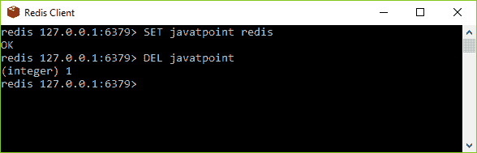

# 重复关键点

> 哎哎哎:# t0]https://www . javatppoint . com/redis-keys

Redis 密钥与 Redis 命令一起使用来管理它们自己。请参见在命令中使用 Redis 键的语法。

**语法:**

```
redis 127.0.0.1:6379> COMMAND KEY_NAME 

```

**例**

让我们举一个 Redis 键与 Redis DEL 命令一起使用的例子。如果键被删除，它将给出输出 1，否则它将是 0。

```
redis 127.0.0.1:6379> SET javatpoint redis 
OK 
redis 127.0.0.1:6379> DEL javatpoint
(integer) 1 

```



这里，“DEL”是一个 Redis 命令，而“javatpoint”是一个键。

* * *

## 使用命令重定向关键点

| 索引 | 命令 | 描述 |
| one | del sey？del sey | 该命令用于删除密钥(如果存在)。 |
| Two | 转储键 | 此命令用于返回存储在指定键中的值的序列化版本。 |
| three | EXISTS 密钥 | 此命令用于检查密钥是否存在。 |
| four | 过期密钥 | 该命令用于在指定时间(以秒为单位)后设置密钥的有效期。 |
| five | 过期关键点 | 此命令用于设置指定时间后密钥的到期时间。这里的时间是 UNIX 时间戳格式。 |
| six | 可以解释关键点 | 此命令用于以毫秒为单位设置密钥的到期时间。 |
| seven | PEXPIREAT key(密钥) | 此命令用于设置 UNIX 时间戳中密钥的到期时间，以毫秒为单位。 |
| eight | 按键模式 | 此命令用于查找与指定模式匹配的所有键。 |
| nine | 移动键 | 它用于将密钥移动到另一个数据库。 |
| Ten | 持久键 | 它用于删除密钥的过期时间。 |
| Eleven | PTTL 密钥 | 它用于检索密钥到期的剩余时间(以毫秒为单位)。 |
| Twelve | TTL 键 | 它用于检索密钥过期的剩余时间。 |
| Thirteen | 兰托姆 | 它用于从 Redis 获取随机密钥。 |
| Fourteen | 重命名密钥 newkey | 它用于更改密钥名称。 |
| Fifteen | RENAMENX 键 newkey | 如果新密钥不存在，它用于重命名密钥。 |
| Sixteen | 类型键 | 它用于获取存储在键中的值的数据类型。 |