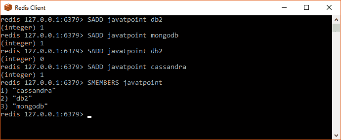

# 重复一遍

> 哎哎哎:# t0]https://www . javatppoint . com/redis 集

Redis 集合是唯一字符串的无序集合。唯一字符串意味着集合中没有重复的单个字符串。

在 Redis 集合中，添加、移除和测试 O(1)中成员的存在性(不考虑集合中包含的元素数量，时间不变)。列表的最大长度是每个集合超过 40 亿个元素。

## 例子

```
redis 127.0.0.1:6379> SADD javatpoint db2
(integer) 1
redis 127.0.0.1:6379> SADD javatpoint mongodb
(integer) 1
redis 127.0.0.1:6379> SADD javatpoint db2
(integer) 0
redis 127.0.0.1:6379> SADD javatpoint cassandra
(integer) 1
redis 127.0.0.1:6379> SMEMBERS javatpoint
1) "cassandra"
2) "db2"
3) "mongodb"

```



在上面的例子中，您可以看到我们已经使用 SADD 命令在集合中添加了 4 个元素。但是使用 SMEMBERS 命令只检索到 3 个元素，因为一个元素是双重的，并且 Redis 集只读取重复的值一次。

* * *

## 重新编写命令集

| 索引 | 命令 | 描述 |
| one | SADD 主要成员 1[成员 2] | 它用于向集合中添加一个或多个成员。 |
| Two | SCARD 钥匙 | 它用于获取集合中成员的数量。 |
| three | SDIFF 键 1[键 2] | 它用于减去多个集合。 |
| four | SDIFFstore 目标键 1[键 2] | 它用于减去多个集合，并将结果集合存储在一个键中。 |
| five | 烧结键 1[键 2] | 它用于相交多个集合。 |
| six | sinterestore 目标键 1[键 2] | 它用于相交多个集合，并将结果集合存储在一个键中。 |
| seven | SISMEMBER 关键成员 | 它用于确定给定值是否是集合的成员。 |
| eight | SMOVE 源目标成员 | 它用于将成员从一个集合移动到另一个集合。 |
| nine | SPOP 密钥 | 它用于从集合中移除并返回随机成员。 |
| Ten | SRANDMEMBER 键[计数] | 它用于从集合中获取一个或多个随机成员。 |
| Eleven | SREM 主要成员 1[成员 2] | 它用于从集合中移除一个或多个成员。 |
| Twelve | SUNION 键 1[键 2] | 它用于添加多个集合。 |
| Thirteen | SUNIONSTORE 目标键 1[键 2] | 它用于添加多个集合并将结果集合存储在一个键中。 |
| Fourteen | SSCAN 键光标[匹配模式][计数] | 它用于增量迭代集合元素。 |