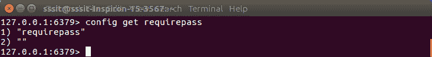
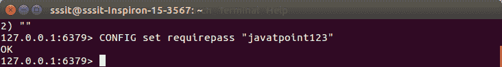
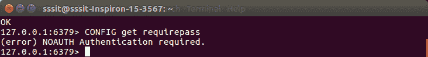

# Redis 安全公司

> 哎哎哎:# t0]https://www . javatppoint . com/redis-security

安全性对于数据库来说是非常必要的，以保证数据的安全。它提供身份验证，因此如果客户端想要建立连接，需要在执行命令之前进行身份验证。

您需要在配置文件中设置一个密码来保护 Redis 数据库。

### 例子

让我们看看如何保护您的 Redis 实例。

使用“配置获取命令”

```
config get requirepass

```



您可以看到上面的属性是空的，这意味着我们没有这个实例的任何密码。您可以通过执行以下命令来更改此属性并为此实例设置密码。

```
config set requirepass "javatpoint123"

```



```
CONFIG get requirepass

```



当您设置此密码时，如果客户端在没有身份验证的情况下运行该命令，他将获得一个错误“需要无验证验证”。因此，客户端需要使用 AUTH 命令来验证自己。

* * *

## AUTH 命令的用法

```
127.0.0.1:6379> AUTH "javatpoint123"
OK
127.0.0.1:6379> SET mykey "hindi100"
OK
127.0.0.1:6379> GET mykey
"hindi100"
127.0.0.1:6379>

```

