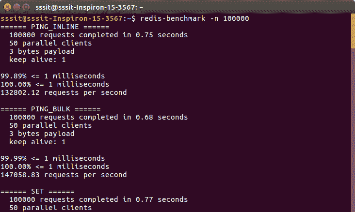
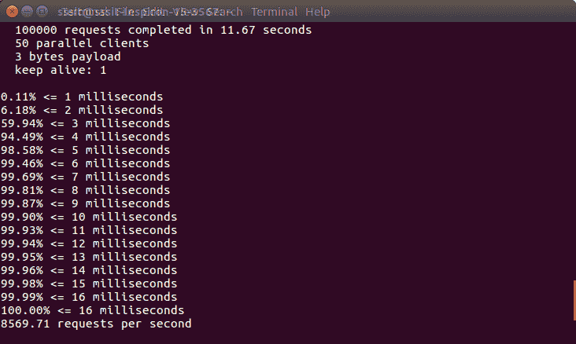
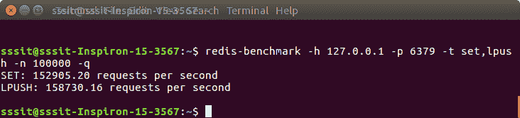

# 重复基准测试

> 哎哎哎:# t0]https://www . javatppoint . com/redis 基准

Redis benchmark 是一个实用工具，用于通过同时使用多个(n)命令来检查 Redis 的性能。

**语法**

```

redis-benchmark [option] [option value]

```

### 例子

让我们调用 Redis 基准命令:

redis 基准-n 100000




请参见 Redis 基准测试中的可用选项列表:

| 索引 | [计]选项 | 描述 | 缺省值 |
| one | -h | 指定服务器主机名 | 127.0.0.1 |
| Two | -p | 指定的服务器端口 | Six thousand three hundred and seventy-nine |
| three | 构成名词复数 | 指定的服务器套接字 |  |
| four | -c | 指定并行连接数 | Fifty |
| five | 同-EN | 指定请求的总数 | ten thousand |
| six | -d | 以字节为单位指定设置/获取值的数据大小 | Two |
| seven | k | 1 =保持活动，0 =重新连接 | one |
| eight | -r | 对 SET/GET/INCR 使用随机键，对 SADD 使用随机值 |  |
| nine | -p | 管道<numreq>请求</numreq> | one |
| Ten | -h | 指定服务器主机名 |  |
| Eleven | q | 强制安静到 Redis。仅显示查询/秒值 |  |
| Twelve | - csv | 以 CSV 格式输出 |  |
| Thirteen | -我 | 生成循环，永远运行测试 |  |
| Fourteen | 相当于-ED | 仅运行逗号分隔的测试列表 |  |
| Fifteen | 我 | 空闲模式。只需打开 N 个空闲连接并等待 |  |

* * *

### 例子

让我们举一个例子来展示 Redis 基准工具中的多个使用选项。

```

redis-benchmark -h 127.0.0.1 -p 6379 -t set,lpush -n 100000 -q  

```

