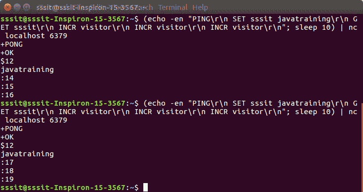

# 瑞迪斯·皮林林

> 哎哎哎:# t0]https://www . javatppoint . com/redis-pipelining

在了解流水线之前，先了解 Redis 的概念:

Redis 是一个支持请求/响应协议的 TCP 服务器。在 Redis 中，请求分两步完成:

*   客户端通常以阻止服务器响应的方式向服务器发送查询。
*   服务器处理命令并将响应发送回客户端。

* * *

## 什么是流水线

流水线便于客户端向服务器发送多个请求，而根本不需要等待回复，最后只需一步就能读取回复。

**例**

让我们看一个 Redis 流水线的例子。在这个例子中，我们将一次向 Redis 提交多个命令，Redis 将在一个步骤中提供所有命令的输出。

打开 Redis 终端并使用以下命令:

```
(echo -en "PING\r\n SET sssit javatraining\r\n GET sssit\r\n INCR visitor\r\n INCR visitor\r\n INCR visitor\r\n"; sleep 10) |
 nc localhost 6379

```



这里:

*   PING 命令用于检查 Redis 连接。
*   一个名为“sssit”的字符串集的值为“javatraining”。
*   获取键值，并将访问者人数增加三倍。

您可以看到，每次值增加时。

* * *

## 流水线的优势

Redis 流水线的主要优点是加快了 Redis 的性能。由于多个命令同时执行，它极大地提高了协议性能。

## 流水线与脚本

Redis 脚本在 Redis 2.6 或更高版本中可用。使用脚本来执行服务器端所需的大量工作，可以更有效地解决大量流水线用例。

脚本的主要优点是它可以以最小的延迟读取和写入数据。它使读、算、写等操作非常快。

另一方面，流水线不使用这个场景。在流水线操作中，客户端在调用写命令之前需要读命令的回复。